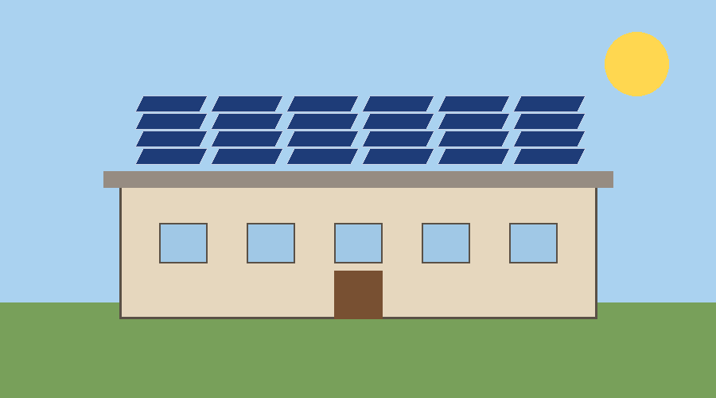

<!-- e1 type=noise subtype=header page=0 -->
Solar Schools Programme - Maintenance Guide

<!-- e2 page=0 -->
# Solar Schools Programme: Maintenance Guide

<!-- e3 page=0 -->
This guide tells school staff how to keep a rooftop solar installation working. **Read it before the first cleaning.**

<!-- e4 page=0 -->
## 1. Monthly tasks

<!-- e5 page=0 -->
Do these tasks once a month, on a dry day:

<!-- e6 page=0 -->
- Clean every panel with water and a soft cloth
- Check that no cable is loose or exposed
- Write the inverter reading in the log book

<!-- e7 page=0 -->
### 1.1 Cleaning steps

<!-- e8 page=0 -->
1. Switch off the inverter
2. Rinse the panels from the top down
3. Switch the inverter on and check the green light

<!-- e9 page=0 -->
## 2. Who does what

<!-- e10 type=caption page=0 reference=e11 -->
Table 1: Responsibilities

<!-- e11 page=0 -->
| Task | Person | How often |
| --- | --- | --- |
| Cleaning | Caretaker | Monthly |
| Inverter check | District engineer | Quarterly |
| Log review | Head teacher | Monthly |

<!-- e12 page=0 -->
The next table shows the fault codes; the first column is shared by two rows.

<!-- e13 page=0 -->
<table>
<tr><th>Code</th><th>Meaning</th><th>Action</th></tr>
<tr><td rowspan="2">E1</td><td>Low voltage</td><td>Wait for sunlight</td></tr>
<tr><td>No voltage</td><td>Call the engineer</td></tr>
</table>

<!-- e14 type=caption page=0 reference=e13 -->
Table 2: Fault codes

<!-- e15 page=1 -->
## 3. A clean installation

<!-- e16 page=1 -->

<!-- e17 type=caption page=1 reference=e16 -->
Figure 1: Panels after cleaning

<!-- e18 page=1 -->
Panels should look like this after every cleaning. *Dust cuts output by a fifth.*

<!-- e19 page=1 -->
> A clean panel is a working panel.

<!-- e20 type=noise subtype=footer page=1 -->
Internal document
