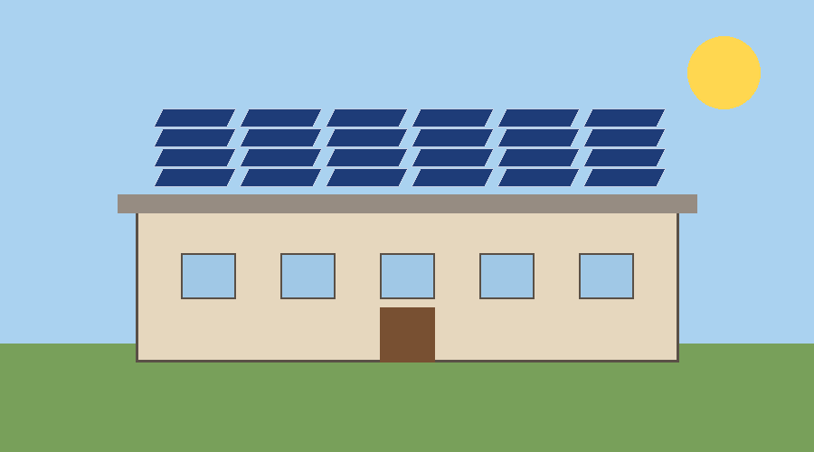

<!-- e1 type=noise subtype=header page=0 bbox=95,30,384,43 -->
Solar Schools Programme - Annual Report 2026

<!-- e2 page=0 bbox=131,91,551,124 -->
# Solar Schools Programme

<!-- e3 page=0 bbox=131,134,833,168 -->
Annual report on the rooftop solar installations completed in 240 schools during 2026. The programme is funded jointly by the state and the participating districts.

<!-- e4 page=0 bbox=131,179,264,202 -->
## 1. Summary

<!-- e5 page=0 bbox=131,208,844,259 -->
Installed capacity reached 9.6 megawatts across all schools, which is 20 percent more than planned. Electricity bills fell by an average of 61 percent. Three districts finished ahead of schedule and two are still in progress because of monsoon delays.

<!-- e6 page=0 bbox=131,268,398,285 -->
The main results of the year were:

<!-- e7 page=0 bbox=131,294,580,365 -->
- 240 schools connected, 40 kilowatts each on average
- 9.6 megawatts of installed capacity
- 61 percent lower electricity bills

<!-- e8 page=0 bbox=131,374,361,397 -->
## 2. Results by district

<!-- e9 page=0 bbox=131,403,731,420 -->
Table 1 lists the schools completed and the capacity installed in each district.

<!-- e10 page=0 bbox=131,430,563,558 -->
| District | Schools | Capacity (kW) | Bill reduction |
| --- | --- | --- | --- |
| Patna | 62 | 2,480 | 64% |
| Gaya | 48 | 1,920 | 59% |
| Muzaffarpur | 55 | 2,200 | 62% |
| Bhagalpur | 41 | 1,640 | 58% |
| Darbhanga | 34 | 1,360 | 60% |

<!-- e11 type=caption page=0 bbox=131,557,414,572 reference=e10 -->
Table 1: Completed installations by district

<!-- e12 type=noise subtype=page_number page=0 bbox=479,949,521,962 -->
Page 1

<!-- e13 type=noise subtype=header page=1 bbox=95,30,384,43 -->
Solar Schools Programme - Annual Report 2026

<!-- e14 page=1 bbox=131,91,386,114 -->
## 3. A typical installation

<!-- e15 page=1 bbox=131,120,869,171 -->
Most schools received panels on the main building. The photo below shows a completed rooftop in Gaya district. Panels are cleaned monthly by the school's maintenance staff, and the inverter is checked every quarter by the district engineer.

<!-- e16 page=1 bbox=262,181,738,383 -->

<!-- e17 type=caption page=1 bbox=131,382,434,396 reference=e16 -->
Figure 1: Rooftop panels on a school in Gaya

<!-- e18 page=1 bbox=131,410,336,433 -->
## 4. Problems found

<!-- e19 page=1 bbox=131,439,843,506 -->
Two problems appeared during the year. The first was theft of cables at four schools, which was solved by moving the inverters indoors. The second was shading from trees, which reduced output at eleven schools; the trees were trimmed and output recovered within a month. Neither problem is expected to

<!-- e20 type=noise subtype=page_number page=1 bbox=479,949,521,962 -->
Page 2

<!-- e21 type=noise subtype=header page=2 bbox=95,30,384,43 -->
Solar Schools Programme - Annual Report 2026

<!-- e22 page=2 bbox=131,92,856,125 continues=e19 -->
recur in 2027 because the new installation checklist covers both. The checklist is attached as an appendix.

<!-- e23 page=2 bbox=131,137,263,160 -->
## 5. Next year

<!-- e24 page=2 bbox=131,165,863,182 -->
The programme will add 300 schools in 2027 and start battery storage trials in twenty of them.

<!-- e25 type=noise subtype=page_number page=2 bbox=479,949,521,962 -->
Page 3
